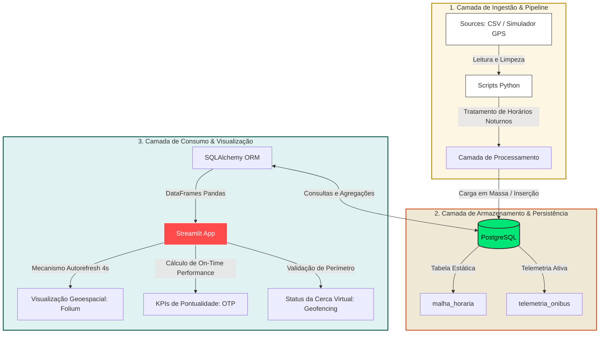

# 🚌 BusFlow RP — Painel Analítico & Engenharia de Dados


> **Status do Projeto:** Concluído 🚀

O **BusFlow RP** é uma plataforma de Engenharia de Dados ponta a ponta desenvolvida para monitorar, auditar e otimizar a eficiência do transporte público urbano de Ribeirão Preto em tempo real.

A solução consome dados brutos de telemetria veicular, processa regras de negócio diretamente na camada de dados e transforma sinais de GPS em indicadores estratégicos para acompanhamento operacional e tomada de decisão.

---

# 📸 Demonstração do Sistema

## 🏠 Tela Inicial (Onboarding)

Tela inicial de boas-vindas do sistema, desenvolvida para apresentar os recursos da plataforma e facilitar a navegação do usuário.


---

## 🗺️ Monitoramento em Tempo Real & Cerca Virtual

Ao selecionar uma linha operacional, o sistema calcula indicadores em tempo real e renderiza o mapa dinâmico de telemetria ativa.


---

# 🎯 Problema & Solução

Garantir a qualidade do transporte público exige monitoramento contínuo. Sem auditoria operacional eficiente, atrasos recorrentes, desvios de rota e falhas de operação podem passar despercebidos pelos órgãos gestores.

O **BusFlow RP** resolve esse cenário através de três pilares principais:

---

## ✅ 1. On-Time Performance (OTP)

Calcula em tempo real o desvio entre o horário planejado da operação e o horário efetivo capturado via telemetria GPS.

### Indicadores gerados:
- Atraso médio por linha
- Antecipações operacionais
- Percentual de viagens no horário
- Monitoramento contínuo da pontualidade

---

## 🌍 2. Geofencing (Cerca Virtual)

Implementa validações geográficas diretamente na base de dados para detectar:

- Desvios de itinerário
- Saídas de rota
- Inconsistências operacionais
- Falhas de cobertura da linha

---

## 📡 3. Telemetria em Tempo Real

Renderiza mapas interativos com atualização automática a cada 4 segundos, permitindo:

- Visualização da frota em tempo real
- Rastreamento operacional
- Identificação de ruídos de sinal
- Acompanhamento contínuo da operação

---

# 🏗️ Arquitetura e Fluxo de Dados (Data Pipeline)

O **BusFlow RP** opera através de um pipeline de dados estruturado em três camadas principais:

- Ingestão
- Armazenamento/Persistência
- Consumo/Visualização

O diagrama abaixo representa o fluxo completo do dado, desde a captura até a visualização analítica em tempo real.



---

# 🔍 Detalhes do Fluxo de Ponta a Ponta

## 📥 Extração e Ingestão (`src/scripts/`)

Os dados operacionais brutos são gerados pelo simulador GPS ou extraídos de arquivos estruturados.

Os scripts em Python são responsáveis por:

- Parse dos arquivos
- Limpeza de inconsistências
- Tratamento de dados inválidos
- Conversão de tipagem
- Tratamento de viradas de horário na madrugada
- Padronização das informações operacionais

Essa etapa garante que os dados estejam consistentes antes da persistência no banco.

---

## 🗄️ Persistência (`src/database/`)

Após o processamento, os dados são persistidos no PostgreSQL através da engine do SQLAlchemy.

A modelagem relacional do banco cruza:

- A programação operacional planejada (`malha_horaria`)
- Os dados de telemetria em tempo real (`telemetria_onibus`)

Essa estrutura permite:

- Consultas performáticas
- Correlação entre horário planejado e operação real
- Auditoria operacional
- Cálculo de indicadores de desempenho

---

## 📊 Consumo & Analytics (`src/dashboard/`)

A aplicação Streamlit consulta dinamicamente o banco de dados conforme a linha operacional selecionada pelo usuário.

O processamento em memória realiza:

- Cálculo de atraso operacional em minutos (OTP)
- Validação geográfica de cercas virtuais (Geofencing)
- Atualização automática do painel a cada 4 segundos
- Renderização geoespacial em tempo real utilizando Folium

O dashboard fornece uma visão operacional live da frota, permitindo identificar rapidamente atrasos, desvios de rota e inconsistências de operação.

---

# 🛠️ Arquitetura & Tecnologias

A arquitetura foi estruturada com foco em escalabilidade, separação de responsabilidades e processamento eficiente dos dados.

## 🔧 Stack Tecnológica

| Camada | Tecnologia |
|---|---|
| Linguagem Principal | Python 3.x |
| Dashboard & Interface | Streamlit |
| Visualização Geoespacial | Folium + Streamlit Folium |
| Banco de Dados | PostgreSQL |
| ORM | SQLAlchemy |
| Gerenciamento de Dependências | Poetry |
| Variáveis de Ambiente | Python Dotenv |

---

# 🧱 Estrutura do Projeto

```bash
PROJETO_BUSFLOWRP/
│
├── data/
│   ├── processed/
│   └── raw/
│
├── docs/
│   ├── home.png
│   └── mapa.png
│
├── src/
│   ├── dashboard/
│   │   └── app.py
│   │
│   ├── database/
│   │   ├── connection.py
│   │   └── __init__.py
│   │
│   ├── pipeline/
│   │
│   ├── scripts/
│   │   ├── capturar_rota_real.py
│   │   ├── carga_itinerario_real.py
│   │   ├── carga_itinerarios_em_massa.py
│   │   ├── gerar_itinerarios.py
│   │   ├── ingestao_csv_para_postgres.py
│   │   └── simulador_gps.py
│   │
│   └── tests/
│       └── test_pipeline.py
│
├── .env
├── pyproject.toml
├── poetry.lock
├── requirements.txt
└── README.md
```

---

# 🚀 Como Executar o Projeto Localmente

## 📋 Pré-requisitos

Antes de começar, você precisará ter instalado:

- Git
- Python 3.10+
- PostgreSQL
- Pip
- Poetry (Opcional)

---

## 1️⃣ Clonar o Repositório

```bash
git clone https://github.com/SEU_USUARIO/PROJETO_BUSFLOWRP.git

cd PROJETO_BUSFLOWRP
```

---

## 2️⃣ Configurar Variáveis de Ambiente

Crie um arquivo `.env` na raiz do projeto:

```env
DB_USER=seu_usuario
DB_PASSWORD=sua_senha
DB_HOST=seu_host
DB_PORT=5432
DB_NAME=seu_banco
```

> ⚠️ O arquivo `.env` deve permanecer no `.gitignore` e nunca deve ser enviado para o GitHub.

---

## 3️⃣ Criar Ambiente Virtual

### Linux / Mac

```bash
python -m venv venv

source venv/bin/activate
```

### Windows

```bash
python -m venv venv

venv\Scripts\activate
```

---

## 4️⃣ Instalar Dependências

### Utilizando requirements.txt

```bash
pip install -r requirements.txt
```

### Utilizando Poetry

```bash
poetry install
```

---

## 5️⃣ Executar a Aplicação

```bash
streamlit run src/dashboard/app.py
```

A aplicação será iniciada em:

```bash
http://localhost:8501
```

---

# 🧪 Testes

Os testes automatizados estão localizados em:

```bash
src/tests/
```

Para executar os testes:

```bash
pytest
```

---

# ⭐ Diferenciais Técnicos

- Processamento de telemetria em tempo real
- Geofencing aplicado diretamente no banco de dados
- Atualização automática do dashboard
- Arquitetura modular
- Integração Python + PostgreSQL
- Visualização geoespacial interativa
- Simulação de GPS para testes operacionais
- Pipeline de dados ponta a ponta
- Monitoramento operacional em tempo real

---

# 📈 Funcionalidades do Dashboard

- ✅ Monitoramento em tempo real
- ✅ KPIs operacionais
- ✅ Geolocalização da frota
- ✅ Cerca virtual (Geofencing)
- ✅ Atualização automática
- ✅ Auditoria operacional
- ✅ Indicadores de pontualidade
- ✅ Interface interativa

---

```

---

# 👨‍💻 Autor

Desenvolvido por **Eduardo Henrique** 🚀

Projeto voltado para estudos práticos de:

- Engenharia de Dados
- Geoprocessamento
- Monitoramento em tempo real
- Visualização analítica
- Arquitetura de dados com Python