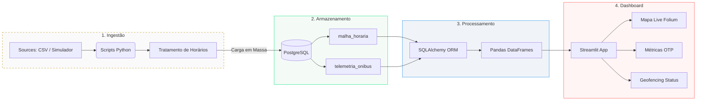

# 🚌 BusFlow RP  
### Plataforma de Monitoramento Operacional & Engenharia de Dados para Transporte Público


---

## 📌 Sobre o Projeto

O **BusFlow RP** é uma plataforma de Engenharia de Dados ponta a ponta desenvolvida para monitorar, auditar e analisar operações do transporte público urbano em tempo real.

A solução integra processamento de dados, persistência relacional, telemetria GPS e visualização geoespacial interativa, transformando sinais operacionais brutos em indicadores estratégicos para acompanhamento da frota.

O projeto foi construído utilizando arquitetura modular baseada em:

- Pipeline de ingestão de dados
- Persistência relacional com PostgreSQL
- Processamento analítico em Python
- Dashboard interativo com Streamlit
- Visualização geoespacial com Folium

---

# 📸 Demonstração do Sistema

## 🏠 Tela Inicial

Interface inicial desenvolvida para apresentar os indicadores operacionais e facilitar a navegação entre os módulos do sistema.


---

## 🗺️ Monitoramento Operacional em Tempo Real

Visualização dinâmica da telemetria da frota, incluindo:

- Atualização automática
- Rastreamento geográfico
- KPIs operacionais
- Validação de geofencing


---

# 🎯 Objetivo da Plataforma

Garantir visibilidade operacional contínua da frota de transporte público através de monitoramento em tempo real, validações geográficas e indicadores analíticos.

A plataforma permite:

- Detectar atrasos operacionais
- Identificar desvios de rota
- Monitorar veículos em tempo real
- Validar cercas virtuais (Geofencing)
- Auditar a operação planejada versus executada

---

# ⚙️ Principais Funcionalidades

## ✅ On-Time Performance (OTP)

Cálculo de atraso operacional baseado na diferença entre:

- Horário planejado
- Horário efetivamente capturado via GPS

### Indicadores:
- Atraso médio
- Antecipações
- Percentual de pontualidade
- Performance operacional por linha

---

## 🌍 Geofencing

Sistema de validação geográfica responsável por detectar:

- Saídas de rota
- Desvios operacionais
- Ruptura de perímetro
- Inconsistências de itinerário

---

## 📡 Telemetria Live

Atualização operacional contínua da frota com refresh automático a cada 4 segundos.

### Recursos:
- Rastreamento em tempo real
- Visualização geoespacial dinâmica
- Monitoramento da operação ativa
- Tratamento de ruído de sinal GPS

---

# 🏗️ Arquitetura e Fluxo de Dados

O BusFlow RP opera através de um pipeline de dados estruturado em quatro camadas:

1. Ingestão
2. Armazenamento
3. Processamento
4. Visualização

O fluxo abaixo representa o ciclo de vida completo do dado.



---

# 🧵 Pipeline de Dados — Fluxo Ponta a Ponta

## 📥 Camada de Ingestão (`src/scripts/`)

Os dados operacionais são capturados através de:

- Arquivos CSV
- Simulação GPS
- Scripts de ingestão

### Responsabilidades:
- Parse dos dados
- Limpeza de inconsistências
- Tratamento de jornadas noturnas
- Conversão de tipagem
- Padronização operacional

---

## 🗄️ Camada de Persistência (`src/database/`)

Após o tratamento, os dados são persistidos no PostgreSQL utilizando SQLAlchemy ORM.

### Estruturas principais:
- `malha_horaria`
- `telemetria_onibus`

### Objetivos:
- Persistência relacional
- Correlação planejamento × execução
- Auditoria operacional
- Base analítica

---

## ⚙️ Camada de Processamento

O backend realiza:

- Consultas SQL dinâmicas
- Agregações operacionais
- Processamento analítico
- Cruzamento entre telemetria e horários

Os dados são estruturados em **Pandas DataFrames** para processamento em memória.

---

## 📊 Camada de Dashboard (`src/dashboard/`)

A aplicação Streamlit consome os dados processados e renderiza:

- KPIs operacionais
- Mapas dinâmicos
- Indicadores OTP
- Status de Geofencing

### Recursos:
- Atualização automática
- Dashboard em tempo real
- Renderização geoespacial com Folium
- Processamento analítico live

---

# 🛠️ Stack Tecnológica

| Camada | Tecnologia |
|---|---|
| Linguagem Principal | Python 3.12 |
| Dashboard | Streamlit |
| Visualização Geoespacial | Folium |
| Banco de Dados | PostgreSQL |
| ORM | SQLAlchemy |
| Processamento Analítico | Pandas |
| Gerenciamento de Dependências | Poetry |
| Configuração de Ambiente | Python Dotenv |

---

# 🧱 Estrutura do Projeto

```bash
PROJETO_BUSFLOWRP/
│
├── data/
│   ├── processed/
│   └── raw/
│
├── docs/
│   ├── home.png
│   └── mapa.png
│
├── src/
│   ├── dashboard/
│   │   └── app.py
│   │
│   ├── database/
│   │   ├── connection.py
│   │   └── __init__.py
│   │
│   ├── pipeline/
│   │
│   ├── scripts/
│   │   ├── capturar_rota_real.py
│   │   ├── carga_itinerario_real.py
│   │   ├── carga_itinerarios_em_massa.py
│   │   ├── gerar_itinerarios.py
│   │   ├── ingestao_csv_para_postgres.py
│   │   └── simulador_gps.py
│   │
│   └── tests/
│       └── test_pipeline.py
│
├── .env
├── pyproject.toml
├── poetry.lock
├── requirements.txt
└── README.md
```

---

# 🚀 Como Executar o Projeto

## 📋 Pré-requisitos

- Python 3.10+
- PostgreSQL
- Git
- Pip
- Poetry (Opcional)

---

## 1️⃣ Clonar o Repositório

```bash
git clone https://github.com/eduardohnsantos/Projeto_BusFlowRP

cd PROJETO_BUSFLOWRP
```

---

## 2️⃣ Configurar Variáveis de Ambiente

Crie um arquivo `.env`:

```env
DB_USER=seu_usuario
DB_PASSWORD=sua_senha
DB_HOST=seu_host
DB_PORT=5432
DB_NAME=seu_banco
```

---

## 3️⃣ Criar Ambiente Virtual

### Linux / Mac

```bash
python -m venv venv

source venv/bin/activate
```

### Windows

```bash
python -m venv venv

venv\Scripts\activate
```

---

## 4️⃣ Instalar Dependências

### requirements.txt

```bash
pip install -r requirements.txt
```

### Poetry

```bash
poetry install
```

---

## 5️⃣ Executar o Dashboard

```bash
streamlit run src/dashboard/app.py
```

Aplicação disponível em:

```bash
http://localhost:8501
```

---

# 🧪 Testes

Os testes automatizados estão localizados em:

```bash
src/tests/
```

Executar testes:

```bash
pytest
```

---

# ⭐ Diferenciais Técnicos

- Pipeline de dados ponta a ponta
- Processamento analítico em tempo real
- Geofencing integrado
- Visualização geoespacial dinâmica
- Atualização automática do dashboard
- Arquitetura modular
- Integração Python + PostgreSQL
- Simulação GPS para testes operacionais
- Monitoramento operacional contínuo

---

# 📈 Recursos Analíticos

- ✅ Monitoramento da frota em tempo real
- ✅ Indicadores de pontualidade
- ✅ Rastreamento geográfico
- ✅ KPIs operacionais
- ✅ Auditoria operacional
- ✅ Geofencing
- ✅ Dashboard interativo
- ✅ Atualização live

---

# 👨‍💻 Autor

Desenvolvido por **Eduardo Henrique** 🚀

Projeto voltado para estudos práticos de:

- Engenharia de Dados
- Geoprocessamento
- Monitoramento em tempo real
- Visualização analítica
- Arquitetura de dados com Python
